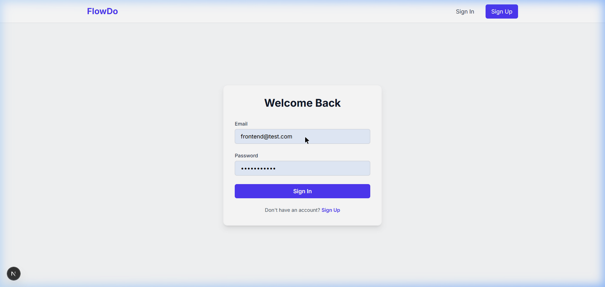
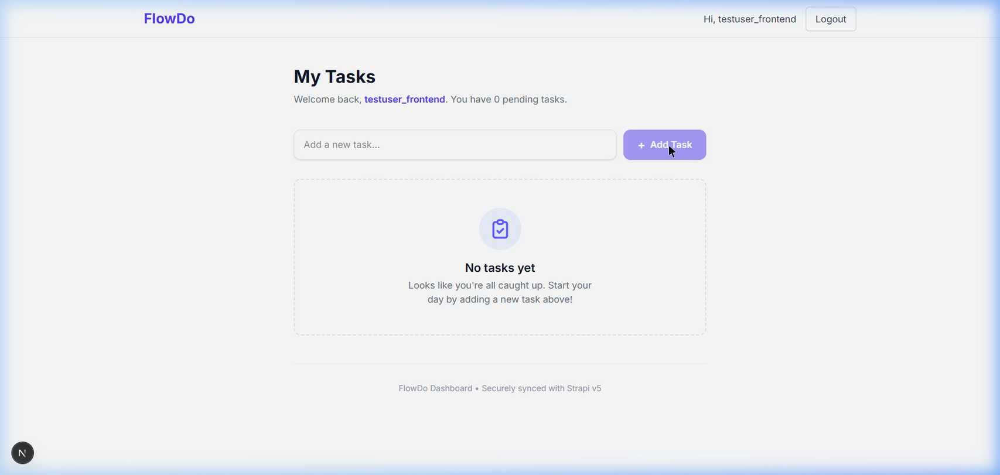
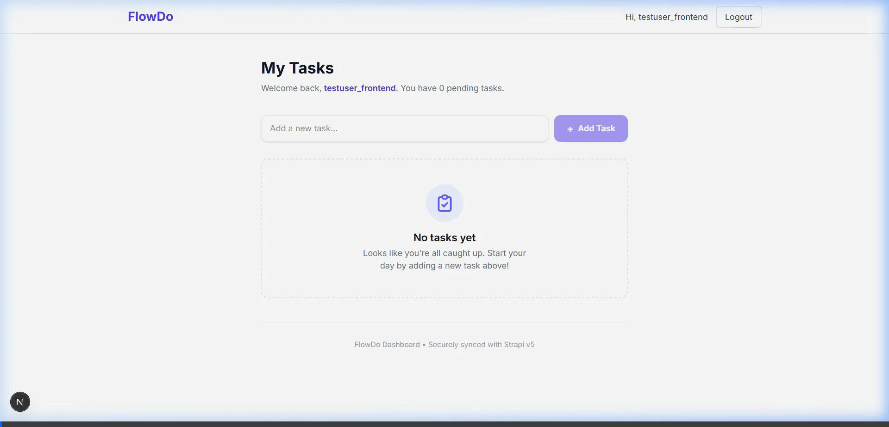

# FlowDo

A full-stack Todo application built with Next.js 16 and Strapi v5 featuring JWT authentication, protected routes, and user-specific task management.

## 🚀 Features

- User Registration & Login
- JWT-based Authentication
- Protected Dashboard Routes
- User-specific Todo Management
- Create, Update, and Delete Todos
- Persistent Login Sessions
- Responsive Dashboard UI
- Loading and Error States
- Zustand-based State Management

## 📸 Screenshots

### Login Page


### Dashboard


### Demo


## 🛠️ Tech Stack

### Frontend
- Next.js 16 (App Router)
- TypeScript
- Tailwind CSS
- Zustand
- Axios
- js-cookie

### Backend
- Strapi v5
- SQLite (Development)
- JWT Authentication (Users & Permissions Plugin)

## 📦 Project Structure

```text
FlowDo/
├── frontend/
│   ├── src/app/          # App Router pages
│   ├── src/components/   # Reusable UI components
│   ├── src/hooks/        # Custom hooks
│   ├── src/store/        # Zustand state management
│   ├── src/lib/          # Axios configuration
│   └── src/proxy.ts      # Route protection
│
├── backend/
│   ├── src/api/todo/     # Todo collection type
│   └── config/           # Strapi configuration
```

## ⚙️ Getting Started

### Prerequisites
- Node.js 20+
- npm

### Backend Setup
```bash
cd backend
npm install
npm run develop
```
Local Backend: `http://localhost:1337`
Production Backend: `https://flowdo-production.up.railway.app`

### Frontend Setup
Create `frontend/.env.local`:
```env
NEXT_PUBLIC_STRAPI_URL=https://flowdo-production.up.railway.app
```

Run frontend:
```bash
cd frontend
npm install
npm run dev
```
Local Frontend: `http://localhost:3000`

## 🚀 Deployment

The project is configured for easy deployment:
- **Frontend**: Deploy to **Vercel** (Root Directory: `frontend`)
- **Backend**: Deploy to **Railway** or **Render**

### Vercel Monorepo Note
This project uses a monorepo structure. In Vercel, set the **Root Directory** to `frontend` in your Project Settings to ensure automatic detection of the Next.js project.

## 🔐 Authentication & Security
- JWT-based authentication
- Protected routes using Next.js Proxy middleware
- User-specific Todo filtering (Document Service enforced)
- Persistent sessions using `token` cookies and Zustand
- Environment variables for configuration

## ✅ Todo Features
- Create Todos
- View Personal Todos
- Toggle Completion Status
- Delete Todos
- Persistent Data After Refresh

## 📱 Responsive Design
Supports Desktop, Tablet, and Mobile with a premium Dark Mode UI.

## 👨‍💻 Author
**Dhanuja A**

Built as part of a Full-Stack Engineering Internship Assignment.

## 📄 License
This project was developed for educational and internship evaluation purposes.
